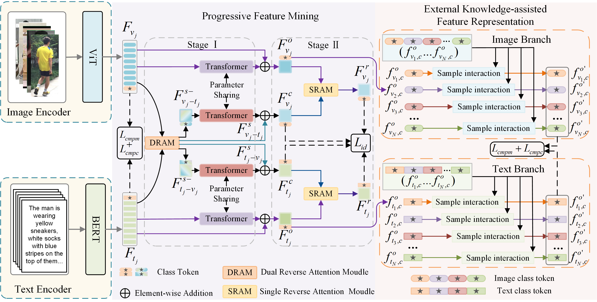

# Progressive Feature Mining and External Knowledge-Assisted Text-Pedestrian Image Retrieval
[Paper](https://arxiv.org/abs/2308.11994)

## Pipeline




## Requirements

### Installation

```shell
pip install -r requirement.txt
```

* requirement:

```
Python 3.9
Pytorch 2.0.0 & torchvision 0.15.0
```

* Modify line 4851-4855 of the ./anaconda3/envs/xxx/lib/python3.9/site-packages/torch/nn/functional.py  file.
  
  Before the modification is as follows:
  ```
    if attn_mask is not None:
        attn = torch.baddbmm(attn_mask, q, k.transpose(-2, -1))
    else:
        attn = torch.bmm(q, k.transpose(-2, -1))     
    attn = softmax(attn, dim=-1)
   ```
  
  After the modification is as follows:
  ```
    if attn_mask is not None:
        #attn = torch.baddbmm(attn_mask, q, k.transpose(-2, -1))
        attn = torch.bmm(q, k.transpose(-2, -1))
        attn = softmax(attn,dim=-1)
        attn = attn*(attn_mask)
    else:
        attn = torch.bmm(q, k.transpose(-2, -1))
        attn = softmax(attn, dim=-1)
    #attn = softmax(attn, dim=-1)
   ```


### Prepare Datasets
Download the CUHK-PEDES dataset from [here](https://github.com/ShuangLI59/Person-Search-with-Natural-Language-Description), ICFG-PEDES dataset from [here](https://github.com/zifyloo/SSAN) and RSTPReid dataset form [here](https://github.com/NjtechCVLab/RSTPReid-Dataset)

Organize them in `your dataset root dir` folder as follows:
```
|-- your dataset root dir/
|   |-- <CUHK-PEDES>/
|       |-- imgs
|            |-- cam_a
|            |-- cam_b
|            |-- ...
|       |-- reid_raw.json
|
|   |-- <ICFG-PEDES>/
|       |-- imgs
|            |-- test
|            |-- train 
|       |-- ICFG_PEDES.json
|
|   |-- <RSTPReid>/
|       |-- imgs
|       |-- data_captions.json
```
### Data Preparation
* For the CUHK-PEDES dataset:
1. Put reid_raw.json under project_directory/data/
2. run data.sh
3. Copy files **test_reid.json**, **train_reid.json** and **val_reid.json** under CUHK-PEDES/data/ to project_directory/cuhkpedes/processed_data/

* For the ICFG-PEDES dataset:

  run preprocess_icfg.py

* For the RSTPReid dataset:

  run preprocess_rstp.py

* Download [ViT-B_16](https://console.cloud.google.com/storage/vit_models/),  [bert-base-uncased model](https://s3.amazonaws.com/models.huggingface.co/bert/bert-base-uncased.tar.gz) and [vocabulary](https://s3.amazonaws.com/models.huggingface.co/bert/bert-base-uncased-vocab.txt) to project_directory/pretrained_models/


## Training and Evaluation

We utilize 1 RTX3090 GPU for training.
* Doenload project
```
git clone https://github.com/lhf12278/PFM-EKFP.git
cd ./PFM_EKFR
```

* Create environment
```
conda create -n xxx python=3.9
conda activate xxx
```
* Environment configuration
```
pip install -r requirements.txt
```
* Training
```shell
python train.py
```
* Evaluation
```shell
python test.py
```


## Contact

If you have any questions, please feel free to contact me. ( ysd999@163.com ).


